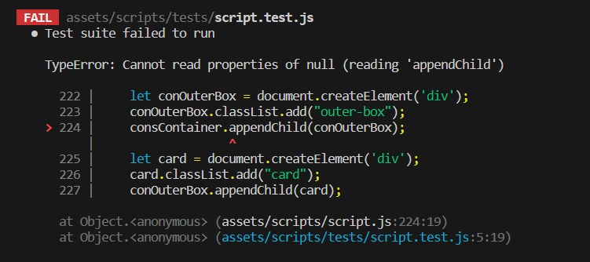
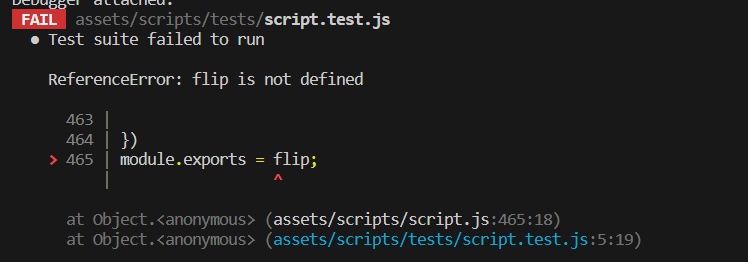
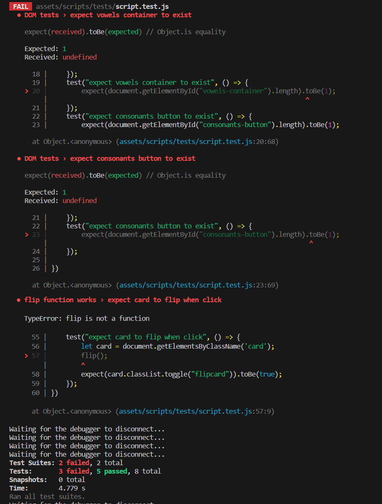
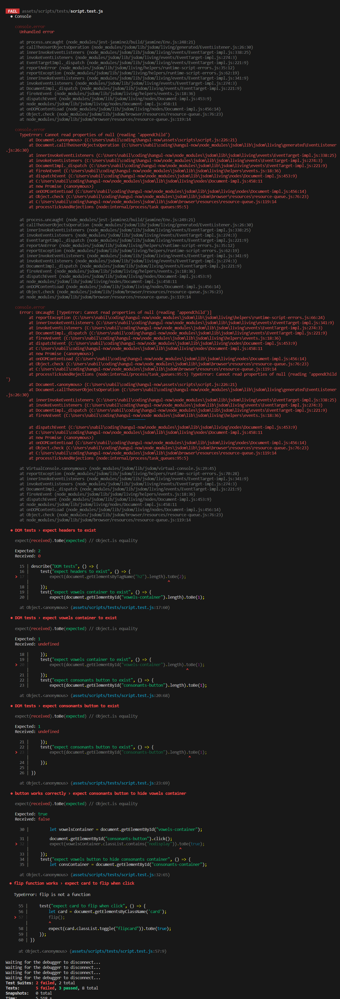
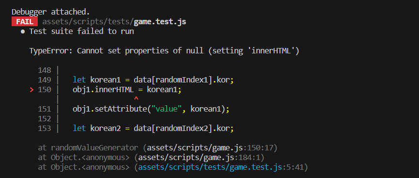
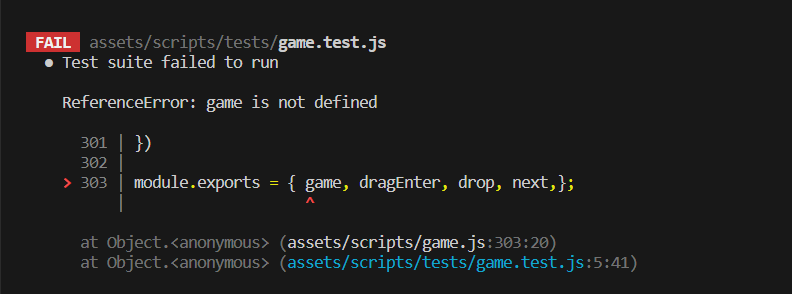

# JEST TESTING

## script.js

I was unable to get Jest to work properly in order to test my code. I tried many methods:

* When I run the test: TypeError: Cannot read properties of null (reading 'appendChild')

\
*Error 1*

* I tried to add a DOM content loaded event listener but got this error instead:

\
*Error 2*

* However, if I kept the event listener but commented out module.exports, I managed to get some passing tests. The failed tests were because something was undefined or it could not find the function



* I tried to edit my code:

```
for (let i = 0; i < allCons; i++) {
    let conOuterBox = document.createElement('div');
    conOuterBox.classList.add("outer-box");
    conOuterBox.setAttribute('id','con-outer-box');
    let conOuterBoxById  = document.getElementById('con-outer-box')
    conOuterBoxById.appendChild(conOuterBox);

    let card = document.createElement('div');
    card.classList.add("card");
    conOuterBox.appendChild(card);
    let cardfront = document.createElement('div');
    cardfront.innerHTML = korCons[i];
    cardfront.classList.add("card-front");
    conCardContainer[i].appendChild(cardfront);
}
```
* Testing this new code without the event listener but keeping module.exports comes up with error 1

* Testing new code with event listener with module.exports comes up with error 2
  
* Testing the new code with event listener and removing module.exports produces many errors:



## game.js

* Similarly testing game.js was also difficult as it came up with this error:



* If it tried to add a DOM loaded event listener like in the other file, a different error appears:



* However, despite all of these errors, the website still functions correctly