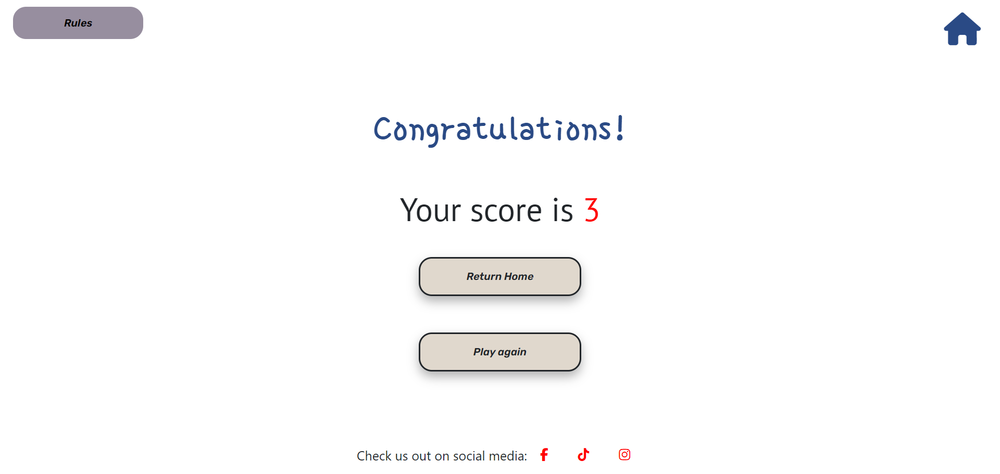

# Hangul Now

Hangul now is an interactive website for visitors to learn the Korean alphabet and how to form letters into syllabic blocks. Visitors can toggle between the Korean and Romanisation of each letter via the flashcards and listen to how it sounds. They can also have a go at playing the drag and drop game where they have to match the correct Korean letter to its sound.

The live link can be found [here](https://nhamidi90.github.io/hangul-now/)

## User stories

### First time visitor goals:
*	I want to learn how to read Korean so that I can be fluent in the Korean language
*	I want the information to be presented in bite size pieces so that I can digest the information easier
*	I want the website to be interactive so that it is fun for me
*	I want the website to give me feedback so I know what I have learnt is correct
*	I want to hear the letters so I can learn correct pronunciation
*	I want the site to be encouraging enough for me to consider learning more

### Returning visitor goals:
*	I want the site to be easy to navigate so I can quickly find what I want to revise
*	I want to check their social media to see if they have any other learning resources or information

### Frequent visitor goals:
*	I want to keep revising the alphabet so that I become confident with reading Korean
*	I want to listen to the pronunciation of the letters so that I can practice pronouncing them correctly
*	I want to test myself so that I can see that my learning is progressing

## Features

### Footer

* All pages will include the footer
* The footer includes links to Facebook, Tiktok and Instagram which open in a new page

### Home page

* The 'Learn the letters' button links to the page where users can learn the korean alphabet
* The 'Test yourself' button leads users to the game page where they can test what they have learnt

### Learn the Letters

* This page includes flashcards of the korean alphabet with a flip effect and audio button under each flashcard to hear the letter
* One side shows the korean letter
* Users can toggle between vowels and consonants
* After flipping, the english transliteration is displayed
* The top displays the logo and a home button. Both lead to the index page

### Test Yourself

* This page displays the game area where users have to match the korean letter to the correct english equivalent by dragging and dropping
* The top displays the rules button and a home button
* There are effects to show when the user is moving the korean letter into the drop zone and when the letter is dropped
* They can then click the button to move to the next round
* Letters are randomly generated and the english boxes are shuffled each round
* If the user leaves any unanswered questions, they will be notified and given the option to answer it or skip to the next question
* Once the user has finished 10 rounds, they will be taken to the results page
* A plugin is used to enable drag and drop for touchscreen

### Results page

* Once users have finished the game they will be directed to the results page with their score
* They have the option to return home or play again

## Technologies Used

* [HTML](https://developer.mozilla.org/en-US/docs/Web/HTML) was used to make the main content of the site
* [CSS](https://developer.mozilla.org/en-US/docs/Web/CSS) was used to add styling
* [Javascript](https://developer.mozilla.org/en-US/docs/Web/JavaScript) was used to add interactivity
* [JQuery](https://jquery.com/) was used to call upon a modal using javascript
* [Flexbox](https://developer.mozilla.org/en-US/docs/Learn/CSS/CSS_layout/Flexbox) was used to align items on the page
* [Bootstrap](https://getbootstrap.com/) was used for creating modals and breakpoints
* [Visual Studio Code](https://code.visualstudio.com/) was the programme used to write and edit code
* [Balsamiq](https://balsamiq.com/) was used to make wireframes
* [Git](https://git-scm.com/) was used for source control management
* [GitHub](https://github.com/) was used to store code for the website
* [GitHub pages](https://pages.github.com/) hosts the website
* [Adobe photoshop](https://www.adobe.com/uk/products/photoshop.html) was used to crop images for the README.md file
* [Adobe Illustrator](https://www.adobe.com/uk/products/illustrator.html) was used to create the logo

## Wireframes

### Desktop screen
* [Home](documentation/wireframes/desktop-index.png)
* [Learn the Alphabet](documentation/wireframes/desktop-letters.png)
* [Test Yourself](documentation/wireframes/desktop-game.png)

### Tablet screen (small and large)
* [Home](documentation/wireframes/tablet-index.png)
* [Learn the Alphabet](documentation/wireframes/tablet-letters.png)
* [Test Yourself](documentation/wireframes/tablet-game.png)

### Mobile screen
* [Home](documentation/wireframes/mobile-index.png)
* [Learn the Alphabet](documentation/wireframes/mobile-letters.png)
* [Test Yourself](documentation/wireframes/mobile-game.png)

## Testing

All information on testing can be found on [TESTING.md](TESTING.md)

## Deployment

### Deployment to GitHub Pages

The site was deployed to GitHub pages. To deploy this site: 
  * In the [GitHub repository](https://github.com/nhamidi90/hangul-now), navigate to the Settings tab
  * Select the **pages** link on the left hand side under *Code and automation*
  * Under *Source*, ensure **Deploy from branch** is selected
  * Under *Branch*, select **main** then **save**
  * The page will automatically refresh and provide a link to your site indicating successful deployment.

The live link can be found [here](https://nhamidi90.github.io/hangul-now/)

### Local Deployment

* To make a local copy of this project, you can clone the repository by typing the following command into your IDE terminal:

 `git clone https://github.com/nhamidi90/hangul-now.git`

- Alternatively, to open the workspace in Gitpod, you can [click here](https://gitpod.io/#https://github.com/nhamidi90/hangul-now)

## Future improvements

* I would like to add a section for users to learn about how to form syllabic blocks used in korean writing so they can learn how to read words
* I would then add explanations on how positioning of some letters affects pronunciation
* I would like to use audio spoken by native speakers as opposed to text to speech as it is more helpful in learning

## Credits

### Content

Hangul letters were referenced from [Fluent in korean](https://fluentinkorean.com/korean-alphabet-2/)

### Media

* Flashcards - [korean background](https://www.freepik.com/premium-photo/watercolor-floral-wreath-background_79576606.htm)
* Flashcards - [english background](https://www.freepik.com/premium-photo/watercolor-floral-wreath-background_79576609.htm)
* [Audio button image](https://pixabay.com/vectors/audio-sound-speaker-button-voice-150191/)

### Tools

* [Speakatoo](https://www.speakatoo.com/) text to speech was used create the audio for the flashcards
* [Bernardo Castilho's](https://github.com/Bernardo-Castilho/dragdroptouch) plugin was used to allow drag and drop to work on touchscreens

### Code

* [MDN web docs](https://developer.mozilla.org/en-US/docs/Web/API/HTMLImageElement/Image) were used to look up syntax such as adding images to the page via javascript
* [Fontawesome](https://fontawesome.com/) gave me the icons used in the footer and navbar
* [Arjun Khara's](https://www.youtube.com/watch?v=OV8MVmtgmoY) walkthough showed me how to do the flipcard effect
* The click and shadow effects of the buttons were taken from [W3Schools](https://www.w3schools.com/css/css3_buttons.asp)
* This video tutorial byt [The wheelchair guy](https://www.youtube.com/watch?v=3xlws5og44U) was followed to add audio to the page via javascript 
* [Stack overflow](https://stackoverflow.com/questions/2450954/how-to-randomize-shuffle-a-javascript-array) showed me how to shuffle the english letters for the drag and drop game and also [open a modal using jQuery](https://stackoverflow.com/questions/30396803/how-to-open-a-modal-in-javascript-instead-of-manual-click)
* This walkthrough by [Coding journey](https://www.youtube.com/watch?v=7HUCAYMylCQ) showed me how to use the drag and drop API 

## Acknowledgements

* Code Institute - This website would not have been possible without their tutorials and walkthroughs. Tutors and slack community gave me help when I had difficulty
* Julie Konovalova - My mentor who has given me a lot of guidance throughout this project
* Falah Hamidi - My brother who helped me with the logic of matching correct drag and drop elements

## Mistakes

* Mistakes were made while commiting messages. I wrote 'Inital commit' more than once as I didn't realise I had already done that
* While trying to solve the issues on the game page I have written that the bug was fixed thinking it was and have had to do/undo some code while testing the site on the responsive viewer to see if it worked