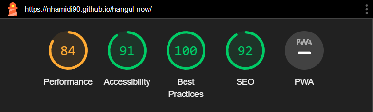
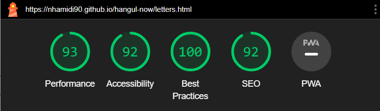
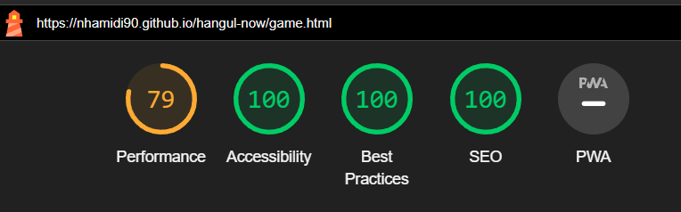

# TESTING

## Compatibility and responsiveness

* The website was tested on three browsers to determine correct appearance, responsiveness and to ensure it works well
* It was tested on Chrome, Firefox and Opera

## Manual testing

|feature	|action	|expected result|	tested	|passed	|comments|
|-----------|-------|---------------|-----------|-------|--------|
|**Footer**					|
|Facebook icon in the footer|	Click on the Facebook icon|The user is redirected to the Facebook page|	Yes|	Yes	|-|
|Tiktok icon in the footer|	Click on the Tiktok icon|The user is redirected to the Tiktok page|	Yes|	Yes	|-|
|Instagram icon in the footer|	Click on the Instagram icon|The user is redirected to the Instagram page|	Yes|	Yes	|-|
|**Navbar**	|
|Logo |Click on the logo| users will be directed to the home page | Yes | Yes | - |
|Home icon |Click on the home icon| users will be directed to the home page | Yes | Yes | - |
|**Home Page**					|
|Learn the alphabet |Click on the "Learn the alphabet" button| The user is redirected to the letters page | Yes | Yes | - |
|Test yoursef |Click on the "Test yourself" button| The user is redirected to the games page | Yes | Yes | - |
|**Learn the letters Page**					|
|Vowels button |Click on the "Vowels" button| Vowels flashcard will be displayed | Yes | Yes | - |
|Consonants button |Click on the "Consonants" button| Consonants flashcard will be displayed | Yes | Yes | - |
|Flashcards |Click on the flashcard| Flashcards will toggle between Korean and English | Yes | Yes | - |
|Audio buttons |Click on the audio buttons| The audio will play | Yes | Yes | - |
|**Test yourself Page**					|
|Drag and drop |drag the korean letter to the english letters| If it is correct, it will stay. If it is wrong, it will return | Yes | Yes | There are effects to show that the element has been dropped |
|Rules button |Click on the "Rules" button| A modal explaining the rules will open | Yes | Yes | - |
|Next button |Click on the Next| The round number will increase by 1 and new letters will be appended to the boxes | Yes | Yes | If user has not answered a question, a model will open up inviting them to answer it or skip |
|**End of game Page**					|
|Score |complete 10 rounds |The score will show|	Yes	|Yes|	-|
|Return home button |Click on the "Return home" button |The user is redirected to the home page|	Yes	|Yes|	-|
|Play again button |Click on the "Play again" button |The user starts a new game|	Yes	|Yes|	-|

## Validator testing

### HTML

### CSS

## Lighthouse report

## Bugs

