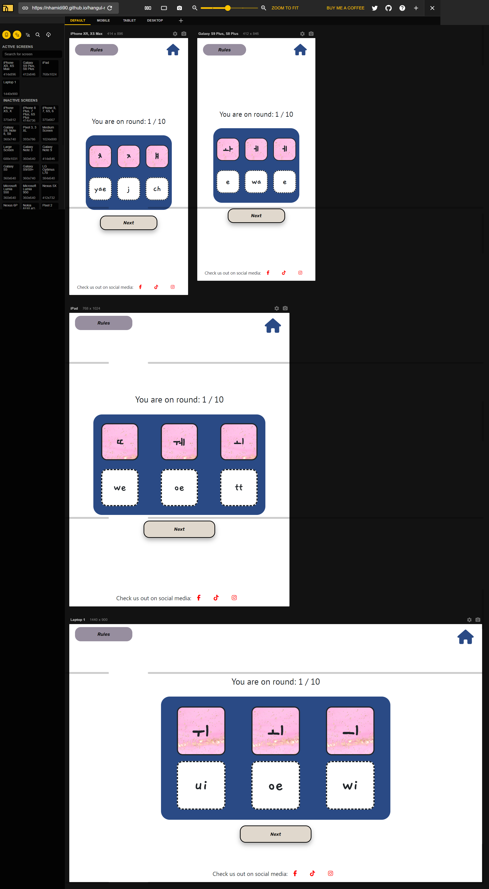
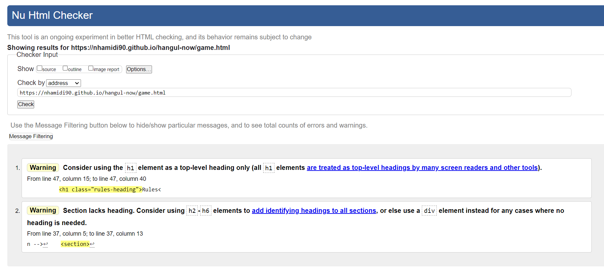
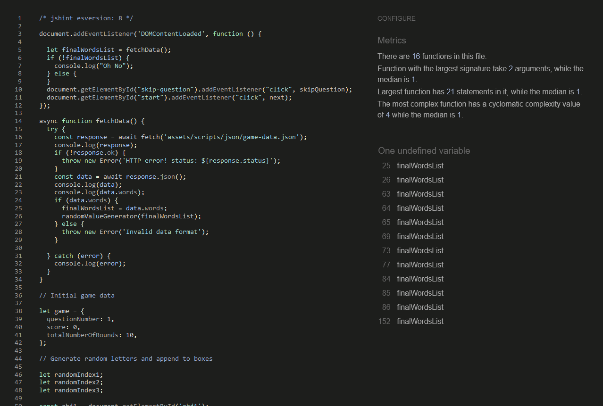

# TESTING

## Compatibility and responsiveness

* The website was tested on three browsers to determine correct appearance, responsiveness and to ensure it works well
* It was tested on Chrome, Firefox and Opera

Chrome:

Firefox:

Opera:

* The responsiveness of the site was also tested using chrome devtools. Devices tested include:

    - iPhone SE
    - iPhone XR
    - iPhone 12 Pro
    - Pixel 5
    - Samsung Galaxy S8+
    - Samsung Galaxy S20 Ultra
    - iPad Mini
    - iPad Air
    - Surface Pro 7
    - Surface Duo
    - Galaxy Fold
    - Samsung Galaxy A51/71
    - Nest Hub
    - Nest Hub Max
    - Laptop

I personally tested the website on Dell Inspiron 5000 laptop and OnePlus Nord 2T mobile

Here is the website tested on different devices:

* Home Page

* Learn the letters Page

* Test Yourself Page

## Manual testing

|feature	|action	|expected result|	tested	|passed	|comments|
|-----------|-------|---------------|-----------|-------|--------|
|**Footer**					|
|Facebook icon in the footer|	Click on the Facebook icon|The user is redirected to the Facebook page|	Yes|	Yes	|-|
|Tiktok icon in the footer|	Click on the Tiktok icon|The user is redirected to the Tiktok page|	Yes|	Yes	|-|
|Instagram icon in the footer|	Click on the Instagram icon|The user is redirected to the Instagram page|	Yes|	Yes	|-|
|**Navbar**	|
|Logo |Click on the logo| users will be directed to the home page | Yes | Yes | - |
|Home icon |Click on the home icon| users will be directed to the home page | Yes | Yes | - |
|**Home Page**					|
|Learn the alphabet |Click on the "Learn the alphabet" button| The user is redirected to the letters page | Yes | Yes | - |
|Test yoursef |Click on the "Test yourself" button| The user is redirected to the games page | Yes | Yes | - |
|**Learn the letters Page**					|
|Vowels button |Click on the "Vowels" button| Vowels flashcard will be displayed | Yes | Yes | - |
|Consonants button |Click on the "Consonants" button| Consonants flashcard will be displayed | Yes | Yes | - |
|Flashcards |Click on the flashcard| Flashcards will toggle between Korean and English | Yes | Yes | - |
|Audio buttons |Click on the audio buttons| The audio will play | Yes | Yes | - |
|**Test yourself Page**					|
|Drag and drop |drag the korean letter to the english letters| If it is correct, it will stay. If it is wrong, it will return | Yes | Yes | There are effects to show that the element has been dropped |
|Rules button |Click on the "Rules" button| A modal explaining the rules will open | Yes | Yes | - |
|Next button |Click on the Next| The round number will increase by 1 and new letters will be appended to the boxes | Yes | Yes | If user has not answered a question, a model will open up inviting them to answer it or skip |
|**End of game Page**					|
|Score |complete 10 rounds |The score will show|	Yes	|Yes|	-|
|Return home button |Click on the "Return home" button |The user is redirected to the home page|	Yes	|Yes|	-|
|Play again button |Click on the "Play again" button |The user starts a new game|	Yes	|Yes|	-|

## Validator testing

### HTML

The website was tested using the [W3C HTML Validator](https://validator.w3.org/nu/) tool

### CSS

The website passed all tests using the [W3C CSS validator](https://jigsaw.w3.org/css-validator/) tool

There were 2 warnings:

### Javascript

The results for javascript validation using the official [JSHint](https://jshint.com/) validator is as follows:

## Lighthouse report

## Bugs

- While creating the flashcards, it was difficult to get the layout right and the flip funtion to work as the tutorial I followed only displayed one card per page whereas I had multiple. To get around this I realised I had to place the card inside another div and set the position to abolute.

- While creating the drag and drop game, I had trouble with transferring the data of the korean letter to the drop zones. It would display the id of the draggable elements. To get around this I set it to another variable and set the innerText of that variable.

- I also had the problem of matching the korean letters to its english equivalent. To solve this I set the attribute for all draggable elements and getting the value for that. I also had to get the value of the target element and store that in a variable so that I can use the find method to compare whether thay are from the same object.

- For the game page there was a problem of responsiveness while on smaller devices. Looking on [Stack overflow](https://stackoverflow.com/questions/14272420/webpage-starts-zoomed-in-on-mobile-devices) gave me the metadata to add to the head tag which I thought solved the problem but I realised I needed to create media queries and change the game play area sizes.

- After I had moved my dictionaries to an external json file, the flip function for the flashcards would only flip once but not back again as the focus of the click has changed after it had been flipped once. I had to add a set timeout to the flip function  and add another function to target the child of the parent element that is being clicked.

- I had problems testing with Jest. documentation can be found [here](JEST-TEST.md)